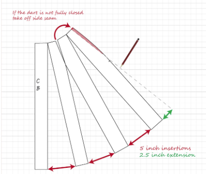

There are a lot of instances in everyday life where we use strategies similar to those of design patterns. It’s best understood as gaining ‘experience’. The more that we’re faced with different problems, the more opportunities we have to solve those problems and, in doing so, form future strategies that are applicable to any situations in the future that have similarities with problems that we’ve faced in the past. In summary, there are countless ways that we as humans apply the same structures as those in design patterns. However, for the sake of this essay, let’s consider the comparisons between the design patterns used in software engineering and a similar-yet-different type of pattern.

## Another Type Of Pattern

Sewing patterns are an essential part of the fashion design process. When making clothes, sewing patterns serve as a template for the size and shape of the pieces needed to assemble the garment. However, these patterns, especially those sold commercially, must be adaptable for different sizes and situations. This is why most commonly sold patterns have multiple adjustable aspects that allow the user to adjust for things like their clothing size or personal modesty preferences. Similarly, design patterns, instead of being a direct solution, are structural templates that can be adjusted to solve a wide variety of software development challenges that fall within their range.

## Adjusting For Customization

Much like software design patterns, the extent to which sewing patterns must be altered is entirely dependent on the complexity of the features that you want to adapt for. For instance, if you wanted a skirt with a longer length than the pattern's, it’s a relatively simple matter of extending certain parts of the pre-existing pattern. However, say you wanted a more complex alteration for the skirt; something like pleats.

A simple sewing pattern for a skirt looks like this:

If you wanted to add pleats to the pattern, part of the altered results could look something like this:

As you can see, this type of alteration is much less intuitive than changing the size or length of a pattern. This is because an alteration like this requires outside knowledge and skills beyond what is provided by the pattern, as well as a more thorough understanding of how the pattern pieces come together to form the final product. The same principle applies to using design patterns in software engineering. While design patterns provide a good template for solutions, they must be adjusted to fit the specifications of the project objective. For projects that require more customization, developers must apply more external knowledge and skills to alter the base structure of a design pattern beyond what it initially offers.

## It’s Up To The Designer

The most notable similarity is the versatility of both sewing and design patterns. You’re able to pick and choose facets from different patterns to combine to suit your specific needs. In the same way that you’d use (among others) a decorative pattern, alongside a composite pattern to create an employee database that allows jobs to have dynamic responsibilities while still being able to group these positions into different departments, you can also use the sleeves from a shirt pattern that you like, along with the bodice of a dress pattern you like to create a new dress that has both desired components. In both scenarios, the outcome is entirely dependent on the ability and knowledge of the designer to choose the appropriate patterns for the task. You wouldn’t use an observer pattern in a system composed of entities that are completely independent of each other. Similarly, you wouldn’t use a dress pattern to make a pair of socks.

