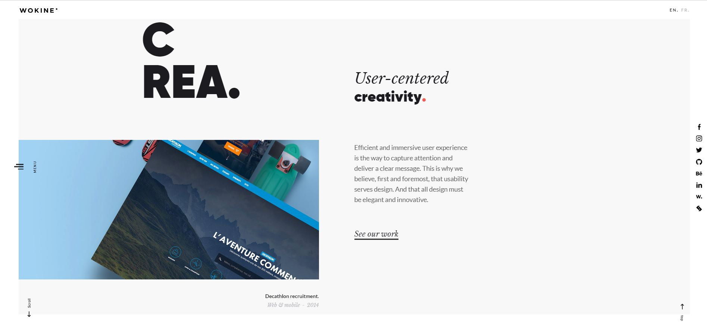
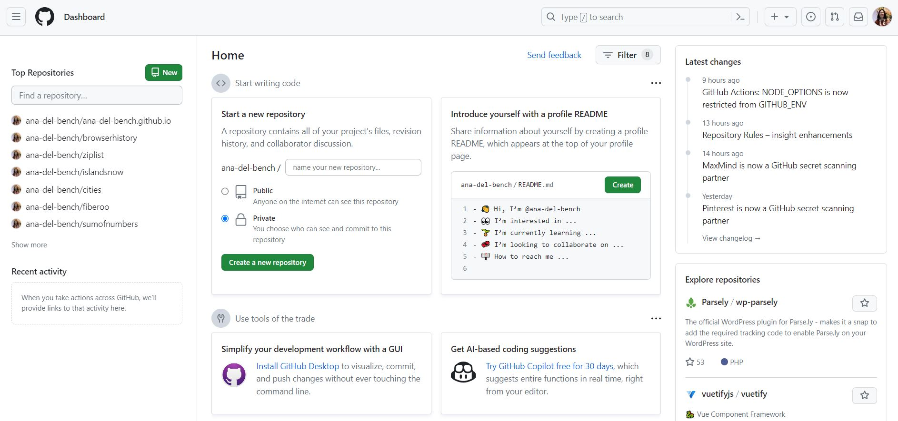

One can compare the functionality of UI Frameworks to that of high-level programming languages like Java or Python. Both sets of tools are built upon lower-level functions in such a way that makes their usage more accessible to beginners. Accessibility may be subjective in this case, as a programmer who is new to web design can be easily overwhelmed by the large additional library that comes with using Bootstrap. However, the vast amount of tutorials and [documentation](https://getbootstrap.com/docs/4.1/getting-started/introduction/) for Bootstrap makes the process of learning Bootstrap much more approachable.

The drawbacks that come with both UI Frameworks and high-level languages are also similar. In these cases, versatility is often sacrificed for convenience. By this I mean that, in the cases of high-level programming languages like Java, the Language is set up in such a way that certain things are done ‘behind the scenes’ for the programmer, regardless of whether or not this is wanted. The same goes for UI Frameworks like Bootstrap. While it makes complicated concepts like responsive design simpler, customization is limited to what you can do within the constraints of the framework.

Despite this, some people have managed to stretch the limits of Bootstrap very far. Take the 
[Wokine](https://www.wokine.com/en/) website for example:

They’ve taken full advantage of the dynamic and responsive features made accessible through Bootstrap.

On the other hand, complex websites with specialized functionality like [GitHub](https://github.com/) do not rely on Frameworks:

The customization levels needed for a website with a complexity like GitHub are easier to achieve by working at ‘lower levels’ where it’s easier to adjust the exact features/functions needed without a framework getting in the way. Typically, programmers start to face issues like this further on into their career when their projects begin to ‘outgrow’ the restrictions of a framework like Bootstrap. However, a beginner looking for simpler designs shouldn’t run into such a problem.

In conclusion, the use of UI Frameworks is entirely dependent on one's skill set and what they are trying to achieve. Beginners will find a helping hand in frameworks like Bootstrap once they get familiar with the basics. Meanwhile, more experienced developers will adapt from project to project and will be able to discern when UI Frameworks will hinder more than help the development process.

