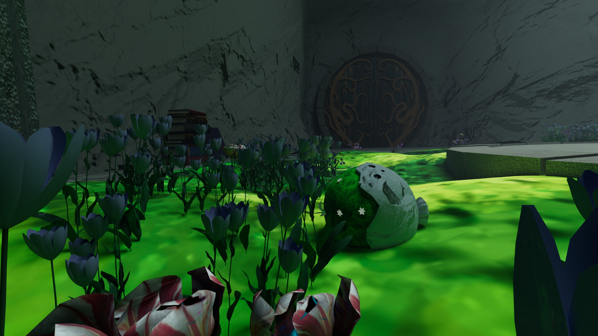
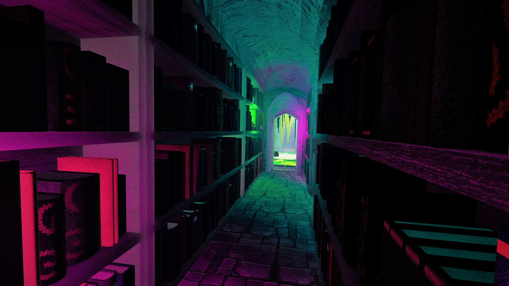
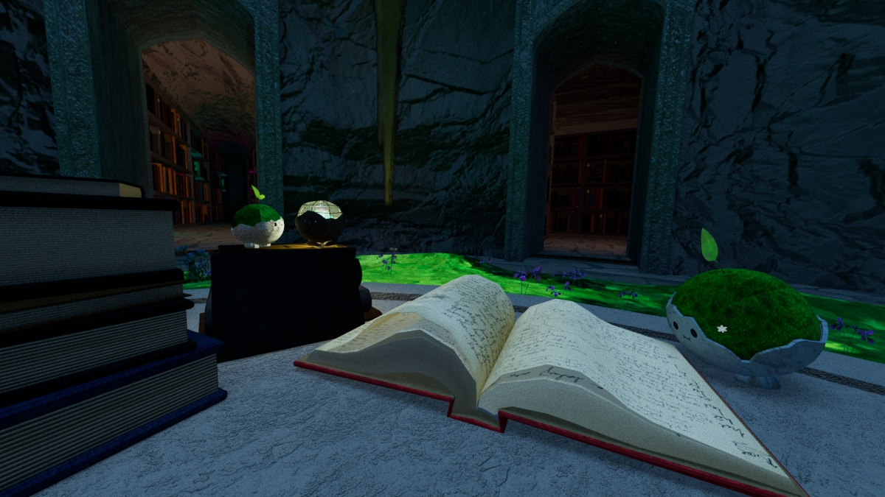
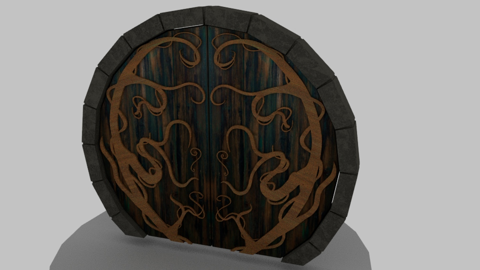
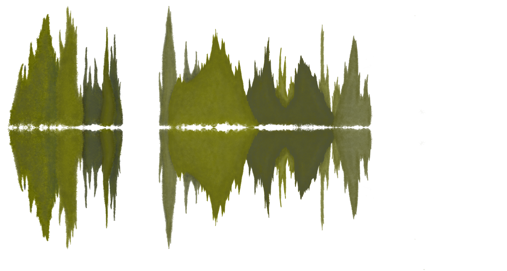

  
  
  

This assignment was to create a virtual environment from scratch using the Maya software.

The resulting images above are the final renders of the environment. Below are a few of the individual elements that I made for said environment, as well as some custom patterns that I designed using the digital software Krita for UV Mapping (custom object "skins").

  
  
  

