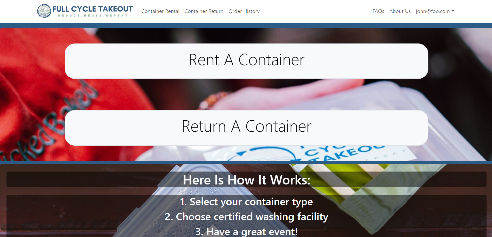

I participated alongside four other team members in HACC (Hawaii Annual Coding Challenge) which allows the participants to pick a challenge from those provided by competition sponsors and develop a solution. Our team organization, dubbed the [Ethical-HACCers](https://github.com/orgs/ethical-haccers/repositories), chose to work on a challenge requesting the development of an application for Full Cycle Takeout; a business that allows users to rent reusable meal containers that, when returned, are washed and sanitized to be reused for another order. After the HACC competition was over, we adapted our project to use as the final project of a mutual computer science course.

My contributions to the project were mainly towards the front-end. I was responsible for the navigation bar of the website, dealing with the mobile compatibility of the landing page (as seen below), as well as contributing to the overall design of the landing page (as seen above) and various other navigation elements. Additionally, I was responsible for the transaction history features for both the admin and general user pages. This entailed various sorting functions for and dealing with user-permissions to allow the admin to view and sort through orders from all customer accounts.

Through this project, I was able to gain experience collaborating with a group through formally organized means like those used in issue-driven project management. I was also able to practice developing and deploying web-applications throughout the course of development. Most notably, the frequent exposure to front-end development has given me a new level of familiarity when using UI (user-interface) frameworks like React and Bootstrap.