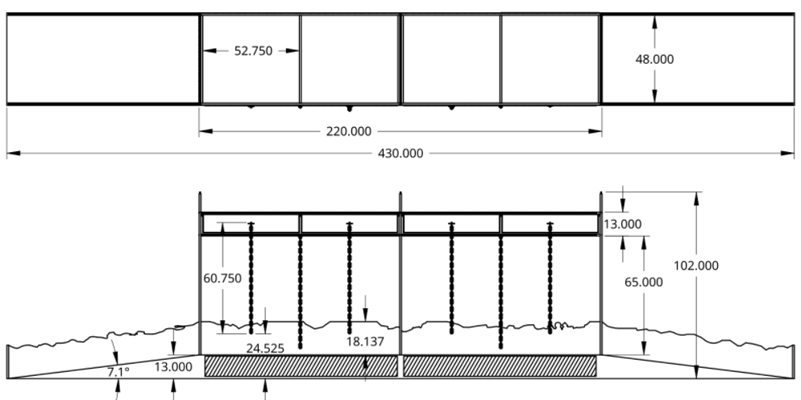

  
  
  

My team competed in a game field design challenge where the objective was to design a game, along with a 3D model of an accompanying playing field for future challenges for the robotics organization FRC.

As a team leader, I was in charge of organizing my teams member's as we designed the individual elements of the playing field, as well as overseeing the overall cohesion and quality of the final product. The team used the CAD software Tinkercad for the development of our project.

Below are some of the official schematics from the design process of the one of the central field elements, the bridge.

  
  

